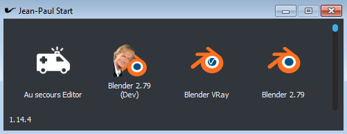

# Jean Paul Start



_L'enfer, c'est les .bats_

- Execution de batches avec une syntaxe proche de celle d'[Ansible](http://docs.ansible.com/ansible/latest/user_guide/playbooks.html)

- Fenêtre affichant les icônes correspondant aux batches

- Extensibilité par plugins

- Utilisé sous Windows, normalement compatible Linux

## Installation

````bash
pip install git+https://github.com/cube-creative/jeanpaulstart.git
````

## Batches

Un batch décrit au format YAML un environnement (à travers des variables), puis des actions à executer

Exemple pour lancer 3Ds Max :

````yaml
---
name: 3Ds Max 2016
icon_path: $ENVIRONMENT\_config\jean-paul-start\icons\max-2016.png
tags: 
  - DCC
  - 3D
  - Max
environment:
  CUBE_ENVIRONMENT: production
  CUBE_MAX_SCRIPTS: $ENVIRONMENT\max-2016
  MAX_VERSION: 2016
  MAX_NAME: Max-$MAX_VERSION
  MAX_DIRECTORY: C:\Program Files\Autodesk\3ds Max $MAX_VERSION
  PYTHONPATH:
    - $MAX_DIRECTORY\python\Lib
    - $ENVIRONMENT\max-2016
    - $ENVIRONMENT\max-2016\python
  INI_TEMPLATE: $ENVIRONMENT\max-2016\config\3dsmax-ini-default-$MAX_VERSION.ini.j2
  INI_SOURCE: $LOCALAPPDATA\Autodesk\3dsMax\$MAX_VERSION - 64bit\ENU\3dsmax.ini
  INI_TARGET: $LOCALAPPDATA\Autodesk\3dsMax\$MAX_VERSION - 64bit\ENU\${MAX_NAME}_3dsmax.ini
  PLUGIN_INI_SOURCE: $CUBE_MAX_SCRIPTS\config\Plugin.UserSettings.ini.j2
  PLUGIN_INI_TARGET: $LOCALAPPDATA\Autodesk\3dsMax\$MAX_VERSION - 64bit\ENU\${MAX_NAME}_Plugin_UserSettings.ini

tasks:
  - name: Copy 3dsmax.ini template if missing
    template:
      src: $INI_TEMPLATE
      dest: $INI_SOURCE
      force: no
      
  - name: Create custom 3dsmax.ini if missing
    copy:
      src: $INI_SOURCE
      dest: $INI_TARGET
      force: no
      
  - name: Additional Icons
    ini_file:
      src: $INI_TARGET
      state: present
      section: Directories
      option: Additional Icons
      value: $ENVIRONMENT\max-2016\resources\icons

  - name: Startup Scripts
    ini_file:
      src: $INI_TARGET
      state: present
      section: Directories
      option: Startup Scripts
      value: $CUBE_MAX_SCRIPTS\maxscript\startupscripts

  - name: AutoBackup Enable
    ini_file:
      src: $INI_TARGET
      state: present
      section: AutoBackup
      value: 1

  - name: Launch 3DS Max 2016
    raw: 
      command: "\"$MAX_DIRECTORY\\3dsmax.exe\" -p ${MAX_NAME}_Plugin_UserSettings.ini %* -i ${MAX_NAME}_3dsmax.ini"
...
````

## Ligne de commande

- Il est possible d'appeler un batch en ligne de commande 

````bash
python -m jeanpaulstart --filepath /path/to/a/batch.yml
````

- Il est possible d'executer un batch au format JSON sérialisé (peu commun)

_L'utilisation du flag `--not-normalized` est conseillée_

````bash
python -m jeanpaulstart --not-normalized --json {"name": "3DS Max", ... }
````

## Interface Graphique

Il existe une version PySide de Jean-Paul Start

Elle se base sur les dossiers contenant des batches, et un fichier de configuration associant les noms d'utilisateurs (obtenus avec `getpass.getuser()`) aux tags présents dans les batches

### Lancement

Il suffit d'appeler le module `jeanpaulstartui`

````bash
python -m jeanpaulstartui --batches /path/to/a/batch/folder;/path/to/another/folder --tags /path/to/user-tags.yml
````

### User Tags

Le fichier user tags représente au format YAML l'association de nom d'utilisateurs à des tags

Exemple

````yaml
---
production:
  - jp.sartre
  - p.deproges

graphist_base:
  - y.montand
  - j.hallyday

rigging:
  - s.weaver
  - j.rochefort
...
````

Ainsi, les batches portant les tags 'production' apparaitront pour l'utilisateur `jp.sartre`

- Il est possible de référencer un groupe dans un autre groupe en utilisant le caractère spécial `$`

````yaml
everyone:
  - $production
  - $graphist_base
  - $rigging
  - m.polnareff
...
````

## Commandes disponibles

Les commandes disponibles sont appelées tâches

L'execution de chaque tâche est décrite dans un module python du package `jeanpaulstart.tasks`

Ces modules sont listés au demarrage de Jean-Paul Start, s'ils répondent aux exigences du plugin-loader, deviennent disponible lors de l'execution des batches

### Copy

Permet de copier un fichier

Si la destination existe, et `force: no`, aucune action n'est effectuée

````yaml
- name: Name of task
  copy:
    src: /path/to/source.ext
    dest: /path/to/destination.ext
    force: [yes|no]
```` 

### File

Créé un fichier ou un dossier

````yaml
- name: Name of task
  file:
    path: /path/to/file
    state: [directory|file]
````

### Include Tasks

Permet d'excuter un batch

L'environnement courant est passé au batch appelé, les modifications faites à l'environnement par le batch appelé ne sont pas conservées dans les tâches suivantes

````yaml
- name: Name
  include_tasks:
    file: path/to/batch/file.yml
```` 

### Ini File

Permet de modifier un fichier .ini

````yaml
- name: Task Name
  ini_file:
    src: /path/to/ini/file.ini
    state: [present|absent]
    section: sectionName
    option: optionName
    value: valueValue
````

### Pip

Execute la commande `pip install`

Le paramètre `state` est facultatif, il vaut `present` par défaut

````yaml
- name: Task Name
  pip:
      name: PySide
      state: [present|forcereinstall]
````

````yaml
- name: Task Name
  pip:
      name: git+http://some/url.git
````

### Raw

Execute une commande dans le terminal

Le paramètre `async` execute la commande dans un processus enfant, sans interrompre l'execution (`Popen()`) (facultatif)
Le paramètre `open_terminal` ouvre un nouveau terminal (facultatif)

`async` vaut `True` par défaut, `open_terminal` vaut `False` par défaut

````yaml
- name: Launch djv_view
  raw: 
    command: "\"C:\\Program Files\\djv-1.1.0-Windows-64\\bin\\djv_view.exe\""
    async:[yes|no]
    open_terminal:[yes|no]
````

### Template

Copie un fichier template au format [Jinja2](http://jinja.pocoo.org/docs/2.10/), en parsant les variables d'environnement

````yaml
- name: Task Name
  template:
    src: /path/to/source.ext.j2
    dest: /path/to/dest.ext
    force: [yes|no]
````

### Url

Ouvre l'url donnée dans le navigateur par défaut

````yaml
- name: Task Name
  url: http://some.url/
````
